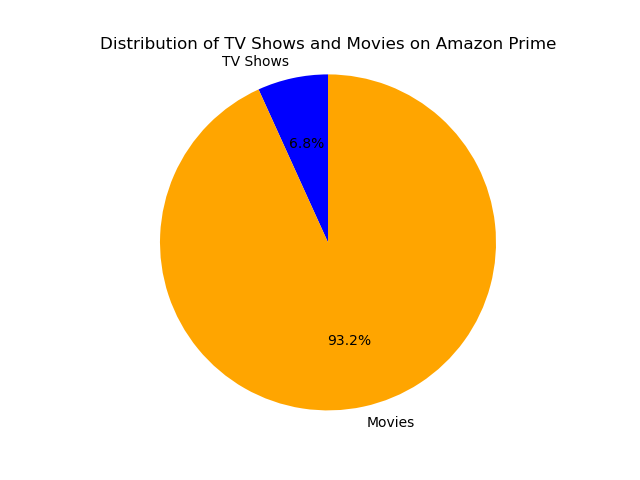
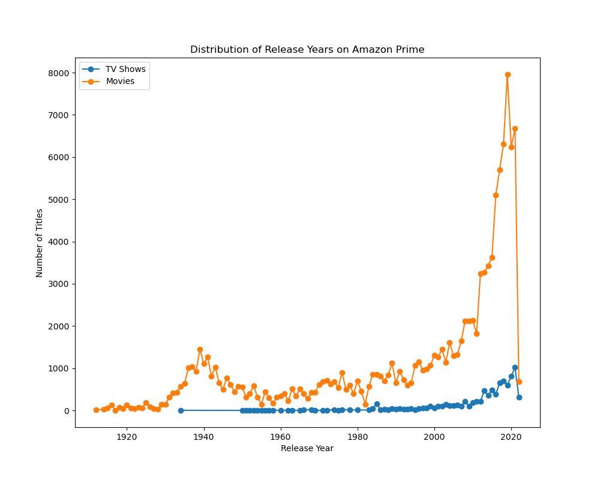
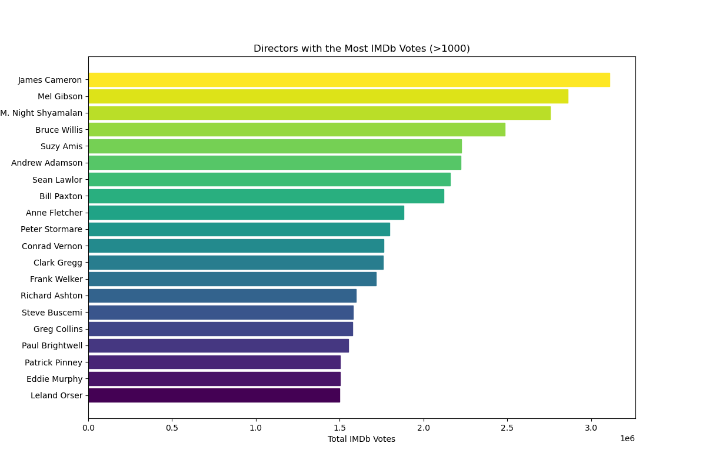
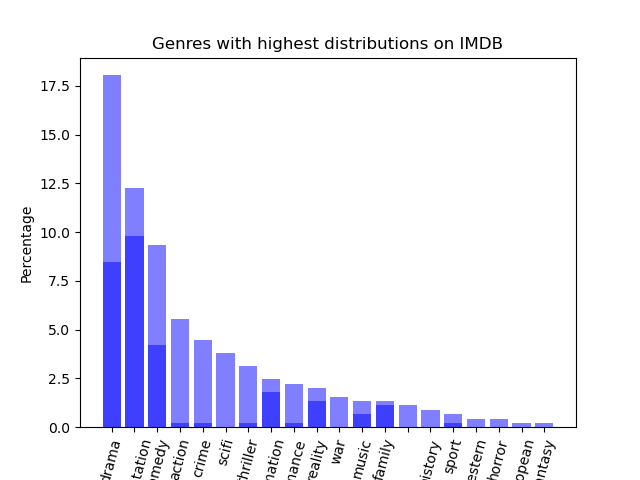
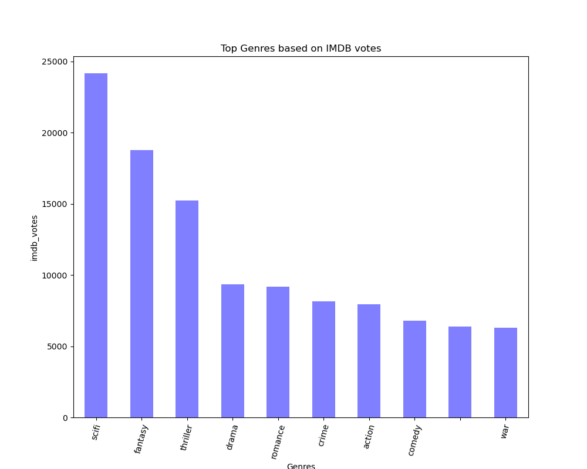
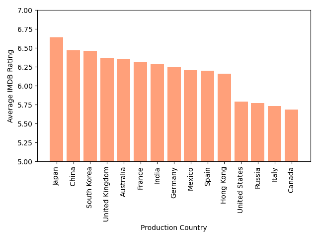
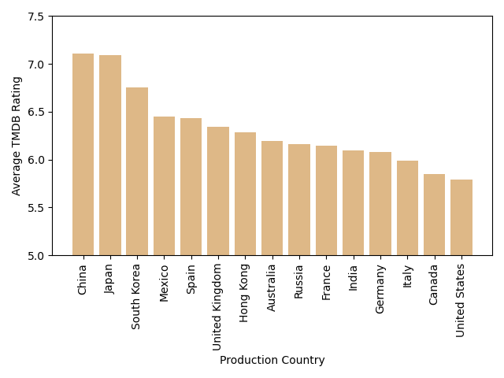
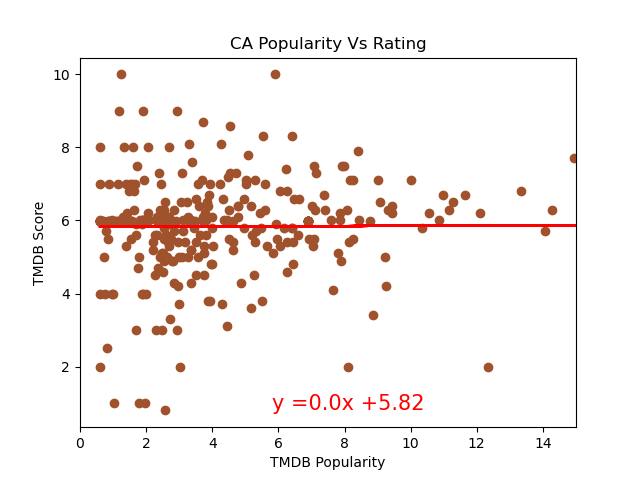
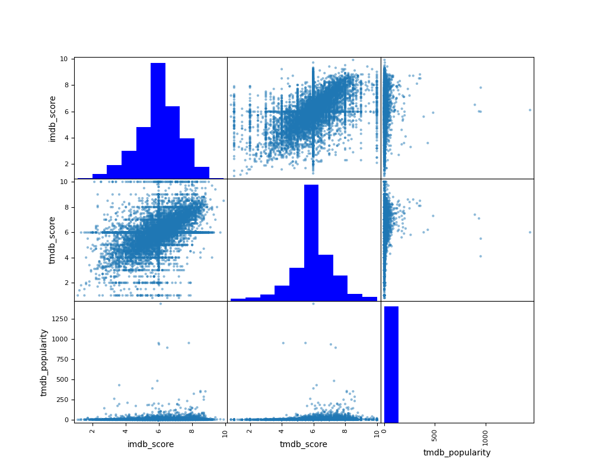

# "Prime Analytics: Unveiling Amazon's Content Success"

This project utilizes the Amazon Prime TV Shows and Movies dataset to uncover insights about the content available on Amazon Prime, including distribution, genre variety, popularity, ratings, and the involvement of actors and directors. This analysis aims to enhance content curation and provide a deeper understanding of the factors contributing to the platform's success.

## Background 

The Amazon Prime TV Shows and Movies dataset from Kaggle consists of two files: "credits.csv" and "titles.csv". The dataset contains information about more than 9,000 unique titles available on Amazon Prime.

The "titles.csv" file includes the following columns:
- "id": The title ID on JustWatch.
- "title": The name of the title.
- "show_type": Indicates whether it is a TV show or a movie.
- "description": A brief description of the title.
- "release_year": The year of release.
- "age_certification": The age certification for the title.
- "runtime": The length of the episode (for TV shows) or movie.
- "genres": A list of genres associated with the title.
- "production_countries": A list of countries that produced the title.
- "seasons": Number of seasons (if it's a TV show).
- "imdb_id": The title ID on IMDB.
- "imdb_score": The score/rating on IMDB.
- "imdb_votes": The number of votes/ratings on IMDB.
- "tmdb_popularity": The popularity rating on TMDB.
- "tmdb_score": The score/rating on TMDB.
- 
The "credits.csv" file contains information about the cast and crew of the titles. It includes the following columns:
- "person_ID": The person ID on JustWatch.
- "id": The title ID on JustWatch.
- "name": The name of the actor or director.
- "character_name": The character name (for actors).
- "role": Indicates whether the person is an ACTOR or DIRECTOR.
  
With this dataset, we can explore various aspects of the titles available on Amazon Prime, such as content distribution, release year, genre distribution, popularity, and ratings on platforms like IMDB and TMDB. Additionally, the credits information allows us to analyze the involvement of actors and directors in the titles.

### Project Requirements

- Use Pandas to clean and format our dataset or datasets.
- Create a Jupyter notebook describing the data exploration and cleanup process.
- Create a Jupyter notebook illustrating the final data analysis.
- Use Matplotlib to create 6 to 8 visualizations of our data (ideally, at least 2 visualizations per “question” that we ask our data).
- Save PNG images of our visualizations to distribute to the class and instructional team—and for
inclusion in our presentation.
- Create a write-up summarizing our major findings. This should include a heading for each “question” that we asked our data as well as a short description of our findings and any relevant plots.

### Research Questions:
 - What is the distribution of TV shows and movies available on Amazon Prime?
 - Are there any trends or patterns in the release years of TV shows and movies available on Amazon Prime?
 - Which directors have the highest total IMDb votes for their movies? (considering only movies with more than 1000 IMDb votes).
 - Which genres have the highest distribution among titles with high IMDB ratings?
 - What are the audience preferences on genres on Amazon Prime based on IMDB votes?
 - How do the average ratings and popularity scores vary across different production countries?
 - Are there any notable differences in ratings and popularity between titles produced in different regions?
 - Are there any correlations between IMDB score, TMDB score, and popularity?

### Instructions
**What is the distribution of TV shows and movies available on Amazon Prime?**
- Filter TV shows and movies from the main dataset
- Get the count of TV shows and movies
- Create labels and sizes for the pie chart
- Create a color palette for the pie chart
- Plot the pie chart and save an image of the chart as a PNG file

**Are there any trends or patterns in the release years of TV shows and movies available on Amazon Prime?**
- Filter TV shows and movies separately
- Count the number of titles released each year for TV shows
- Count the number of titles released each year for movies
- Plot the line chart for TV shows and Movies
- Display the line chart and save an image of the chart as a PNG file

**Which directors have the highest total IMDb votes for their movies? (considering only movies with more than 1000 IMDb votes).**
- Filter movies from the merged dataset
- Filter movies with IMDb votes greater than 1000
- Group movies by director and calculate the total IMDb votes for each director
- Sort the directors based on their total IMDb votes in descending order
- Sort the directors in descending order
- Generate a range of colors using a colormap and plot the horizontal bar chart for top directors and their total IMDb votes
- Display the bar chart and save an image of the chart as a PNG file

**Which genres have the highest distribution among titles with high IMDB ratings?**
- Calculate the highest IMDB ratings
- Calculate the genre frequency of movies and tv shows
- Calculate the total number of titles
- Calculate the percentage of each genre of movies and tv shows
- Plot a stacked bar chart illustrating the genre distribution for titles with high IMDB ratings and save an image of the chart as a PNG file
  

**What are the audience preferences on genres on Amazon Prime based on IMDB votes?**
- Create IMDB DATA FRAME
- Calculate top genres on IMDB
- Create a bar chart to visualize the top genres based on IMDB votes and save an image of the chart as a PNG file

**How do the average ratings and popularity scores vary across different production countries?**
- Remove list formatting of production countries
- Find how many movies were made in each country to get the top 20 most common
- Filter the dataframe to get only the top 20 countries
- Plot a bar chart displaying the average ratings for titles produced in different countries and save an image of the chart as a PNG file
  

**Are there any notable differences in ratings and popularity between titles produced in different regions?**
- Find the popularity and rating values for this country
- Create a scatter plot showing the relationship between ratings and popularity for titles produced in different countries
- Add linear regression line
- Find correlations for different countries and the image should look like this

**Are there any correlations between IMDB score, TMDB score, and popularity?**
- Checking the rows (to get a look at the data & columns required)
- Setting the variables list for the scatter matrix through the columns in the dataframe
- Create a scatter plot visualization using the variables and declare the size of the figures
- Loop that iterates over the indices of the variable list and generates a histogram for each variable in the list
- Display the plot and save an image of the plot as a PNG file

### Limitations of Our Data
- IMDB and TMDB ratings are both databases where the rating is dependent on aggregations of user reviews
- Ratings may be subject to personal opinions and may not be representative of the general public
- The connections made in this analysis with production countries, title genres, distribution, director popularity, timeline, etc. in relation to IMDb/TMDB ratings do not include all relevant variables that may have an effect on ratings/quality of titles on Amazon such as budget, production quality, the viewer/user demographic, etc.

